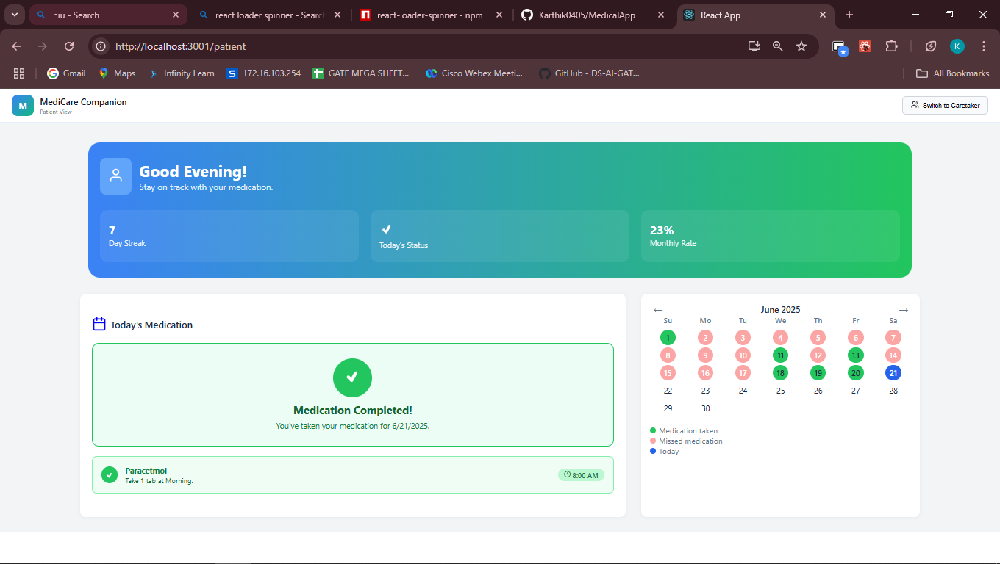
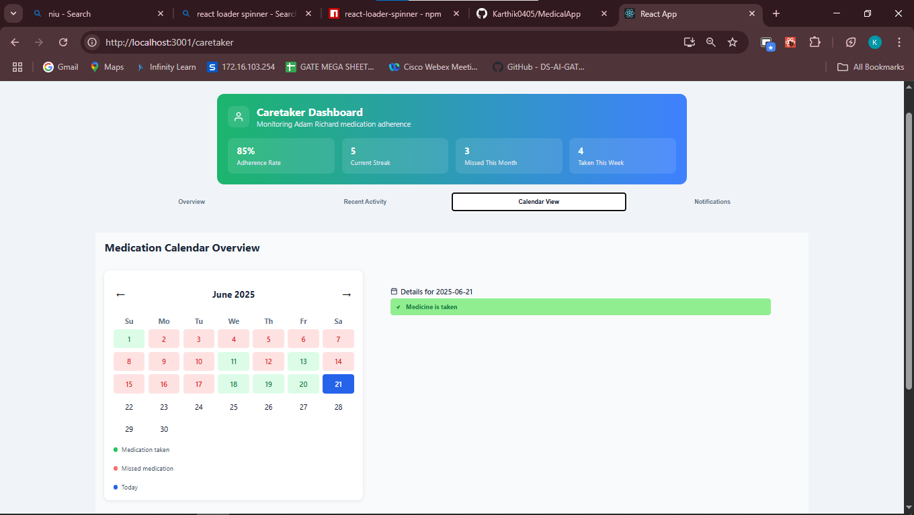

# MediTrack - Medication Tracker App

MediTrack is a full-stack web application built using React.js for the frontend and Node.js + Express for the backend. It helps users track their daily medication, mark medication as taken with proof, and visualize adherence using a calendar UI.

---

## Features

- Calendar view of daily medication
- Mark medication as taken with proof image
- Track day streak and monthly adherence rate
- JWT-based secure authentication
- Responsive and clean UI using Styled Components
- Backend is ready for cloud deployment (SQLite + Express)

---

## 🛠 Tech Stack

| Frontend | Backend          | Database | Auth | UI                             |
| -------- | ---------------- | -------- | ---- | ------------------------------ |
| React.js | Node.js, Express | SQLite   | JWT  | Styled-Components, React Icons |

---

## 📁 Project Structure

meditrack/
├── medicalfrontend/ # React frontend
│ ├── src/
│ └── public/
├── medicalbackend/ # Node.js backend
│ ├── routes/
│ ├── models/
│ └── controllers/
└── README.md

---

## Local Setup Instructions

### 1. Clone the Repository

git clone https://github.com/Karthik0405/MedicalApp.git
cd meditrack

---

### 2. Start Backend

cd medicalbackend
npm install

Create a .env file inside medicalbackend/:

PORT=3000  
JWT_SECRET=your_jwt_secret

Start the backend:

npm start

Runs at: http://localhost:3000

---

### 3. Start Frontend

Open a new terminal:

cd medicalfrontend
npm install
npm start

Runs at: http://localhost:3001

---

Make sure to replace localhost API URLs in React with your live backend URL.

---

## Screenshots

Add UI screenshots here:
Patient-
Caretaker-

---
